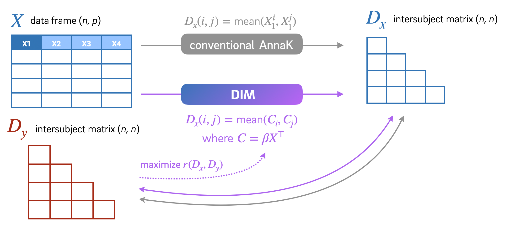
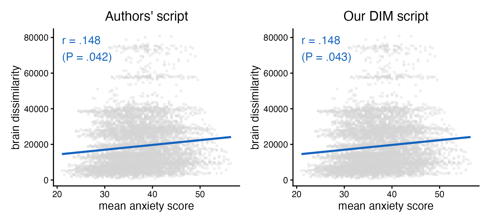
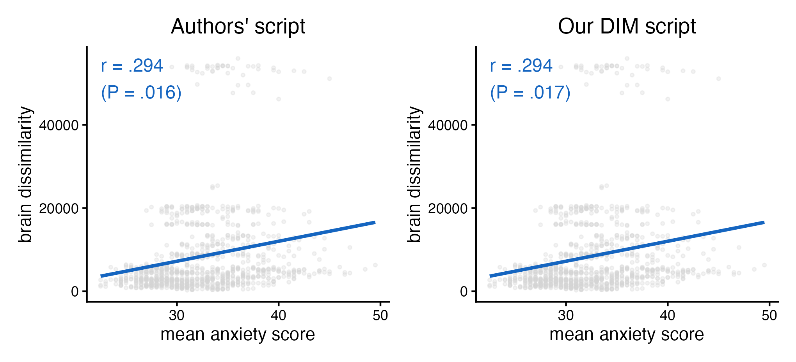
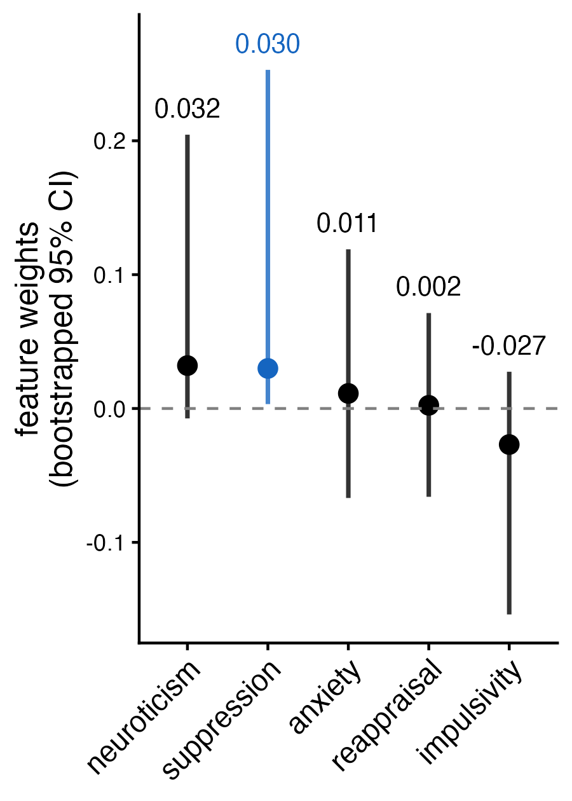

<!-- Replication reports should all use this template to standardize reporting across projects.  These reports will be public supplementary materials that accompany the summary report(s) of the aggregate results. -->

::: {.callout-note}
## Links
- Original Paper: [https://doi.org/10.1073/pnas.2205162119](https://doi.org/10.1073/pnas.2205162119)
- Preregistration for Reprodcution Project: [https://doi.org/10.17605/OSF.IO/38WV4](https://doi.org/10.17605/OSF.IO/38WV4)
- Github Repository for Reproduction Project: [https://github.com/psyc-201/kim2022](https://github.com/psyc-201/kim2022)
::: 

## 1. Introduction
Intersubject representational similarity analysis (IS-RSA) has been widely adopted in neuroscience to quantify the correspondence of individual difference patterns across distinct modalities. Specifically, the **"Anna Karenina"** model, inspired by the passage that "happy families are all alike; every unhappy family is unhappy in its own way", examines how intersubject (dis)similarity in a specific feature space scales as a function of a target variable (e.g., the positive correlation between "unhappiness" and "family pattern dissimilarity"; Finn et al., 2020).

Kim & Kim (2022) demonstrated the utility of the Anna Karenina model in elucidating brain-behavior relationships. Prior neuroimaging studies on the structural connectivity of the ventral prefrontal cortex (vPFC)-amygdala pathway which mainly engages in emotion regulation reported inconsistent associations with trait anxiety, showing mixed positive and negative correlations (e.g., Clewett et al., 2014; Modi et al., 2013; Montag et al., 2012). These inconsistencies may stem from the limitations of scalar proxy measures, such as fractional anisotropy, which fail to capture complex morphological characteristics like kissing cross fibers (Figley et al., 2022; Riffert et al., 2014). To address this, Kim & Kim (2022) hypothesized that high trait anxiety is associated with a global disruption in pathway morphology, leading to a positive association between anxiety levels and morphological dissimilarity. This hypothesis was successfully validated using the Anna Karenina model and replicated in an independent dataset with a distinct age demographic.

Despite its utility, current IS-RSA applications face two major theoretical and methodological limitations. First is the **univariate problem.** Models like Anna Karenina typically rely on a single predictor variable. While effective for specific hypothesis testing, this approach fails to determine if the selected variable is the unique or most robust construct explaining the target representation. For instance, Kim & Kim (2022) noted potential confounding by sex, and the literature suggests other constructs such as emotion regulation strategies (d’Arbeloff et al., 2018; Eden et al., 2015), trait neuroticism (Bjornebekk et al., 2013; Ueda et al., 2018), and trait impulsivity (Peper et al., 2013) also relate to vPFC-amygdala structure. Furthermore, univariate behavior-brain associations often yield small effect sizes and low statistical power, hindering replicability (Genon et al., 2022; Kharabian et al., 2019; Marek et al., 2022). Thus, a data-driven approach is required to identify a "psychological profile" that integrates various variables to maximize the correlation with neural structural variability.

Second is the **equal-weight problem.** Most IS-RSA studies assume that all constituent variables within a domain contribute equally to the pattern of individual differences. For example, Kim & Kim (2022) utilized the unweighted total score of STAI-G-X2, ignoring the possibility that distinct factors (e.g., cognitive vs. affective anxiety) might differentially relate to neural patterns - as the authors mentioned in the limitation section. Weighting signal and noise equally attenuates the true effect size and obscures interpretation, a limitation consistently discussed in RSA literature (Chen et al., 2020; Xie et al., 2025). Therefore, it is necessary to "learn" variable weights that maximize the association with the target domain.

To overcome these challenges, we introduce **DIM (Differentiable Idiosyncrasy Modeling)**, a Python package facilitating flexible IS-RSA pipelines (Lee & Jolly, in prep). `DIM` supports traditional hypothesis testing (e.g., Anna Karenina, Nearest Neighbor) while enabling "hypothesis generation": it accepts multivariate inputs and optimizes weights to maximize correlation with the target distance matrix. This framework allows for systematic comparisons between hypothesis-driven and data-driven models and provides a streamlined workflow for evaluating replicability on unseen data.

In this project, we aim to: (1) reproduce the findings of Kim & Kim (2022) using `DIM`’s hypothesis testing module, thereby simultaneously validating the software and evaluating the reproducibility of the original study; (2) employ `DIM`’s data-driven module to discover  a weighted combination of trait anxiety and other literature-derived factors that best predicts vPFC-amygdala morphology; and (3) assess the generalizability of the identified model in an independent dataset with a completely different age demographic.


## 2. Methods

### 2.1. Planned Sample
In this project, we aim to reproduce the key findings reported by Kim & Kim (2022) regarding the specific cohorts of younger and older adults:

> **Younger adults:** “Mantel tests revealed that the left amygdala-ventral PFC tract-morphology dissimilarity matrix was significantly correlated with the trait-anxiety dissimilarity matrix.”          
> **Older adults:** “Tests on the older adult sample also depicted a significant correlation between the trait-anxiety dissimilarity matrix and the left amygdala-ventral PFC tract-morphology dissimilarity matrix.”

To this end, we will utilize the LEMON dataset (Babayan et al., 2019), consistent with the original study. Following the original protocol, we will subsample participants based on three primary inclusion criteria: (1) age (20–35 years for the younger group; 60–75 years for the older group); (2) availability of diffusion MRI data; and (3) absence of past or current psychiatric disorders as determined by the Structured Clinical Interview for DSM (‘SKID’). The original procedure yielded a final sample of 119 younger and 45 older adults. We will verify whether applying these identical criteria to the raw dataset yields the same sample sizes for each cohort.

### 2.2. Materials
To rigorously evaluate the reproducibility of the statistical results while isolating potential variance arising from preprocessing pipelines, we utilized the preprocessed data generated by the original authors. This approach mitigates discrepancies introduced by the numerous free parameters inherent in neuroimaging preprocessing pipeline. As the original GitHub repository contained only the statistical scripts for IS-RSA, we requested and obtained the specific self-report measures and preprocessed neuroimaging data via direct correspondence with the authors.

From the provided data, the following three components were utilized for the reproduction analysis:

- **Metadata:** Demographic information and psychiatric diagnostic status for all 228 participants.

- **Self-Reported Measures of Trait Anxiety:** STAI-G-X2 total summary scores for 221 participants.

- **Preprocessed Tractography-based Image-Driven Phenotypes (IDPs):** White-matter streamline counts estimated within the "canvas space" of the left vPFC-amygdala pathway for both younger and older groups. The "canvas space" is defined as the union of all voxels identified as part of the pathway across all participants, allowing for direct morphological comparison. The authors flattened the streamline counts of these voxels into 1-dimensional vectors to quantify "morphological dissimilarity" via Euclidean distance (see Kim & Kim (2022)). 

Our analytic procedure followed three steps using these datasets. First, we subsampled the younger and older adults using the metadata, strictly adhering to the exclusion criteria used by the original authors. Second, using the STAI-G-X2 measures of the subsampled participants, we constructed the "anxiety mean matrix" by calculating the average score for all possible participant pairs within each group. Third, utilizing the IDPs, we constructed the "morphological dissimilarity matrix" for each group by computing the Euclidean distance between IDP vectors for all pairs. 

Note that the preprocessed IDP data provided privately by the authors will not be redistributed in our repository; the raw LEMON dataset is publicly available at: [Official Website of LEMON dataset](https://fcon_1000.projects.nitrc.org/indi/retro/MPI_LEMON.html). 

### 2.3. Experimental Procedure	
This project utilizes the LEMON dataset (Babayan et al., 2019), an observational neuroimaging resource; therefore, no experimental manipulations were introduced. Regarding the original data acquisition protocol, participants underwent MRI scanning on the first day and completed self-report measures on the second day.

### 2.4. Analysis Plan

#### 2.4.1. Data sanity check
We assessed whether applying the three exclusion criteria utilized by Kim & Kim (2022) — (1) age range, (2) availability of diffusion MRI-based IDPs, and (3) absence of past or current psychiatric diagnoses — to the provided data would yield identical sample sizes for each cohort. This verification was conducted using the R-based analysis scripts shared by the original authors via [their GitHub repository](https://github.com/humaffectneurolab/MorphSim_TraitAnxiety/blob/main/morphsim.R).

#### 2.4.2. Overall description of DIM
In this project, we employed our custom Python package, `DIM` (Lee & Jolly, in prep), to conduct both confirmatory and exploratory analyses. First, we aimed to reproduce the key findings of Kim & Kim (2022) (**confirmatory**). Second, we sought to identify a novel "psychological profile", a weighted combination of variables previously reported to be associated with vPFC-amygdala structural connectivity, which maximizes the correlation with the individual difference patterns of the pathway (**exploratory**).

`DIM` supports two primary modes, "weight fixation" and "weight learning", facilitating both traditional hypothesis testing (e.g., standard Anna Karenina) and data-driven hypothesis generation (see **Fig 1**). Both modes accept an input feature matrix $X \in \mathbb{R}^{n \times p}$ (where $n$ is the number of samples and $p$ is the number of features) and a target intersubject dissimilarity matrix $D_y \in \mathbb{R}^{n \times n}$. For the Anna Karenina model utilized in this project, the predicted dissimilarity matrix $D_x$ is computed as follows:
$$D_x(i, j) = \frac{C_i + C_j}{2}, \quad \text{where } C = Xw$$

Here, $i$ and $j$ denote the subjects, and $w$ represents the feature weight vector. Essentially, $D_x$ is derived from the pairwise averages of composite scores $C$, which are calculated as the weighted sum of features in $X$. In the weight fixation mode, consistent with the standard Anna Karenina approach, weights are fixed at $w = \mathbf{1}$ (i.e., equal weighting). Consequently, the composite score $C$ becomes an unweighted sum, and no parameter learning occurs. The association between the automatically computed $D_x$ and the target $D_y$ is then evaluated using a specified dependency metric (e.g., Pearson’s $r$ or Spearman’s $\rho$).

Conversely, the weight learning mode iteratively updates $w$ via gradient descent to minimize the following loss function $L$:

$$L = - r(D_x, D_y) + \lambda\big(\alpha \|w\|_1 + (1-\alpha) \|w\|_2^2\big)$$

where $r(D_x, D_y)$ is the dependency metric, $\lambda$ controls the strength of ElasticNet regularization, and $\alpha$ balances Lasso ($L_1$) and Ridge ($L_2$) penalties. This objective function maximizes the correlation between distance matrices while mitigating overfitting in the discovery set. Specifically, ElasticNet-based regularization (Zou & Hastie, 2005) handles multicollinearity among features (Ridge) while inducing sparsity to select the minimal set of features required to maximize the correlation (Lasso).

Notably, when Spearman’s $\rho$ is selected as the dependency metric, the standard calculation involves a non-differentiable rank operation. To enable gradient descent, we employed the SoftRank approximation (Taylor et al., 2008), which provides a differentiable estimate of the rank function, allowing for the calculation of gradients for $r(D_x, D_y)$ at each iteration.

As `DIM` is currently under active development, the source code is not included in the public repository for this project.

::: {.figure}

:::

#### 2.4.3. Confirmatory analysis
We attempted to reproduce the results reported by Kim & Kim (2022) using the weight fixation mode of `DIM`, comparing them against the original R-based analysis pipeline shared by the authors. Successful reproduction was defined based on two a priori criteria:     

- **a.** The Spearman’s $\rho$ estimate between the anxiety mean matrix and the morphological dissimilarity matrix is identical when truncated to the third decimal place.   
- **b.** The Mantel permutation test (10,000 iterations) yields the same conclusion regarding statistical significance at the authors' original threshold of $\alpha = 0.05$.    

We anticipated potential minor discrepancies in p-values derived from the permutation tests, acknowledging that R and Python utilize different algorithms for random number generation, even when initialized with identical seeds. Consequently, we adopted a more lenient criterion for statistical significance (criterion **b**) compared to the strict numerical precision required for the correlation coefficient estimate (criterion **a**).

The analysis proceeded in three steps:     

- **Data Preparation:** For each group, the STAI-G-X2 summary score vector and the intersubject morphological dissimilarity matrix were input into `DIM` as $X$ and $D_y$, respectively. To construct $D_y$, we applied the `pdist` and `squareform` functions to the vPFC-amygdala IDP dataframes (dimensions: $n_{\text{features}} \times n_{\text{subjects}}$) provided by the authors.     

- **Correlation Estimation:** After transforming $X$ into the predicted distance matrix $D_x$ via `DIM`, we vectorized the upper triangular elements of both $D_x$ and $D_y$. The Spearman’s $\rho$ between these two vectors was then calculated.     

- **Permutation-based Inference:** To assess statistical significance, we performed a Mantel permutation test with 10,000 iterations, following the original protocol. In each iteration, the subject indices of $D_y$ were randomly shuffled, and the correlation between the shuffled $D_y$ and the original $D_x$ was computed to approximate the null distribution of $\rho$. As the `vegan` package used by the original authors supports only right-tailed testing, the p-value was defined as the proportion of null $\rho$ values greater than the observed $\rho$.

#### 2.4.4. Exploratory analysis
We conducted an exploratory analysis to determine whether trait anxiety, as prioritized by Kim & Kim (2022), exhibits the strongest association with the individual difference patterns of the vPFC-amygdala pathway compared to other constructs. Ultimately, we aimed to identify a multivariate "psychological profile" that yields a more robust association. The analysis proceeded in four steps:

- **Data Preparation:** We utilized the younger adult cohort (*N* = 119, 20–35 years) as the discovery set and the older adult cohort (*N* = 45, 60–75 years) as the replication set. In addition to the STAI-G-X2 scores and canvas space IDPs used in the original study, we incorporated four self-reported measures previously linked to vPFC-amygdala structural connectivity: (1) Reappraisal and (2) Suppression from the Emotion Regulation Questionnaire (ERQ); (3) Trait Neuroticism from the NEO Five-Factor Inventory; and (4) Lack of Perseverance from the Impulsive Behavior Scale. Complete data were available for all participants. Accordingly, we constructed the feature matrices ($X_{\text{discovery}}$, $X_{\text{replicate}}$) containing the five self-report measures and the corresponding morphological dissimilarity matrices ($D_{y, \text{discovery}}$, $D_{y, \text{replicate}}$) for each cohort.

- **Hyperparameter Tuning:** We sought to identify the optimal combination of four hyperparameters for model training: learning rate (`lr`), early stopping threshold (`min_delta`), and the ElasticNet regularization terms (`lambda` and `alpha`). We employed 5-repeated 3-fold cross-validation on the discovery set. To favor model parsimony and prevent overfitting, the optimal configuration was selected using the one-standard-error rule (Hastie et al., 2008). A total of 81 combinations were explored within the following search space: `lr` $\in [.001, .005, .01]$, `min_delta` $\in [.0001, .0005, .001]$, `lambda` $\in [.001, .01, .1]$, and `alpha` $\in [0, .25, .50]$. The selected optimal parameters were: `lr` $= .01$, `min_delta` $= .0005$, `lambda` $= .1$, and `alpha` $= .50$.

- **Model Training and Interpretation (Discovery):** Using the optimal hyperparameters, we applied the weight learning mode of `DIM` to the discovery set ($X_{\text{discovery}}$, $D_{y, \text{discovery}}$) to identify the composite score mean matrix that maximizes correlation with the morphological dissimilarity matrix. To evaluate the stability and statistical significance of the learned weights for the five features, we performed bootstrapping with 500 iterations. In each iteration, subjects were resampled with replacement to generate new input matrices, and the model was retrained. Significance was determined based on the 95% confidence intervals (CIs) of the weights; a weight was considered significant if its CI did not include zero.      

- **Model Application and Evaluation (Replication):** To assess the generalizability of the identified model, we applied the trained weights to the independent replication set ($X_{\text{replicate}}$, $D_{y, \text{replicate}}$) without further optimization. We evaluated the model's performance by calculating Spearman’s $\rho$ and assessing its statistical significance via a Mantel permutation test (10,000 iterations). In each permutation, the indices of $D_{y, \text{replicate}}$ were randomly shuffled, and the pre-trained model was applied to the shuffled data to approximate the null distribution of Spearman’s $\rho$. The p-value was calculated as the proportion of null statistics exceeding the observed $\rho$.

### 2.5. Differences from the Original Study
The confirmatory analysis was conducted in accordance with the analytic pipeline established by Kim & Kim (2022). The sole methodological distinction lies in the computational implementation: we utilized the Python-based `DIM` package, whereas the original study utilized R-based analysis scripts.

### 2.6. Reliability and Validity
The authors did not explicitly report the reliability and validity of self-reported trait anxiety scores (i.e., STAI-G-X2) and image-driven phenotypes (i.e., the streamline count value between the vPFC and amygdala). In the original LEMON dataset paper (Babayan et al., 2019), the authors reported that STAI-G-X2 showed high reliability, as did its psychometric validation work (in LEMON: Cronbach’s $\alpha$ = .91; in validation work: Cronbach’s $\alpha$: .88 - .94). However, the reliability measure of the image-driven phenotype and the validity measures for both STAI-G-X2 and the image-driven phenotype could not be found anywhere.


## 3. Results

### 3.1. Data Preparation
#### 3.1.1. Young adults group: discovery set
Using the code below, we prepared data for 119 young adults following Kim & Kim (2022). Specifically, we created `X_discovery` (119, 5) and `D_y_discovery`, an intersubject morphological dissimilarity matrix (119, 119). `X_discovery` includes five variables in order: anxiety, reappraisal, suppression, neuroticism, and impulsivity.

```{python}
import numpy as np
import pandas as pd
from scipy.spatial.distance import pdist, squareform

##### PART I. SELF-REPORTED MEASUREMENTS ========================================================================
### I.1. Loading the Rawdata
# from the authors (confirmatory)
meta = pd.read_csv('../data-from-authors/Meta.csv')
STAI = pd.read_csv('../data-from-authors/STAI_G_X2.csv') 
# from the official website (exploratory)
ERQ = pd.read_csv('../Behavioural_Data_MPILMBB_LEMON/Emotion_and_Personality_Test_Battery_LEMON/ERQ.csv') 
NEOFFI = pd.read_csv('../Behavioural_Data_MPILMBB_LEMON/Emotion_and_Personality_Test_Battery_LEMON/NEO_FFI.csv') 
UPPS = pd.read_csv('../Behavioural_Data_MPILMBB_LEMON/Emotion_and_Personality_Test_Battery_LEMON/UPPS.csv') 

### I.2. Sample Filtering
# age
youth = meta[meta['Age'].isin(['20-25', '25-30', '30-35'])]
# IDP availability
exclude_subjects = ['sub-032339', 'sub-032341', 'sub-032459', 'sub-032370', 
                    'sub-032466', 'sub-032438', 'sub-032509']  
youth = youth[~youth['Unnamed: 0'].isin(exclude_subjects)]  
# SKID diagnosis   
youth['SKID_Diagnoses'] = pd.Categorical(youth['SKID_Diagnoses'])
youth['SKID_Diagnoses_numeric'] = youth['SKID_Diagnoses'].cat.codes + 1 
Hyouth = youth[(youth['SKID_Diagnoses_numeric'] == 0) | (youth['SKID_Diagnoses_numeric'] == 10)] 
# leaving only relevant info
columns_to_drop = list(range(3, 14)) + list(range(15, 21))  
Hyouth = Hyouth.drop(Hyouth.columns[columns_to_drop], axis=1)

### I.3. Data Formation
Hyouth = pd.merge(Hyouth, STAI, on = 'Unnamed: 0')
Hyouth = pd.merge(Hyouth, ERQ, on = 'Unnamed: 0')
Hyouth = pd.merge(Hyouth, NEOFFI, on = 'Unnamed: 0')
Hyouth = pd.merge(Hyouth, UPPS, on = 'Unnamed: 0')
# IMPORTANT: matching the order of subjects with brain morphology data
Hyouth = Hyouth.sort_values('Unnamed: 0').reset_index(drop = True) 
# Extracting the Targeted Affective Characteristics
target_cols = ['STAI_Trait_Anxiety', 'ERQ_reappraisal', 'ERQ_suppression' , 'NEOFFI_Neuroticism', 'UPPS_lack_perseverance']
X_discovery_df = Hyouth[target_cols]
X_discovery = X_discovery_df.values

##### PART II. MORPHOLOGICAL IDPs ================================================================================
### II.1. Loading the Rawdata
yh_prob_5p_L = pd.read_csv('../data-from-authors/tractfiles/yh_probmap_5p_L.csv')
yh_prob_5p_L = yh_prob_5p_L.iloc[:, 1:]  # Remove the first column (index)

### II.2. Compute the distance matrix
D_y_discovery = squareform(pdist(yh_prob_5p_L.T, metric = 'euclidean'))

### II.3. Final Check
print(
    "======= DATA CHECK FOR SELF-REPORTED MEASUREMENTS =======\n"
    f"The shape of X_discovery = {X_discovery.shape}.\n"
    f"The number of NaN in X_discovery = {np.isnan(X_discovery).sum()}\n"
    "=========== DATA CHECK FOR vPFC-AMYGDALA MATRIX =========\n"
    f"The shape of D_y_discovery = {D_y_discovery.shape}.\n"
    f"The number of NaN in D_y_discovery = {np.isnan(D_y_discovery).sum()}"
)
```


#### 3.1.2. Older adults group: replicate set
Using the code below, we prepared data for 45 young adults following Kim & Kim (2022). Specifically, we created `X_replicate` (45, 5) and `D_y_replicate`, an intersubject morphological dissimilarity matrix (45, 45). `X_replicate` includes five variables in order: anxiety, reappraisal, suppression, neuroticism, and impulsivity, as `X_discovery` does. 

```{python}
##### PART I. SELF-REPORTED MEASUREMENTS ========================================================================
### I.1. Sample Filtering
# age
senior = meta[meta['Age'].isin(['60-65', '65-70', '70-75'])]
# IDP availability
senior_exclude_subjects = ["sub-032339", "sub-032341", "sub-032459", "sub-032370",
                           "sub-032466", "sub-032438", "sub-032509", "sub-032392", "sub-032443", "sub-032488"]
senior = senior[~senior['Unnamed: 0'].isin(senior_exclude_subjects)]
# SKID diagnosis
senior['SKID_Diagnoses'] = pd.Categorical(senior['SKID_Diagnoses'])
senior['SKID_Diagnoses_numeric'] = senior ['SKID_Diagnoses'].cat.codes + 1 
Hsenior = senior[(senior['SKID_Diagnoses_numeric'] == 5) | (youth['SKID_Diagnoses_numeric'] == 6)]
# leaving only relevant info
Hsenior = Hsenior.drop(Hsenior.columns[columns_to_drop], axis=1)

### I.2. Data Formation
Hsenior = pd.merge(Hsenior, STAI, on = 'Unnamed: 0')
Hsenior = pd.merge(Hsenior, ERQ, on = 'Unnamed: 0')
Hsenior = pd.merge(Hsenior, NEOFFI, on = 'Unnamed: 0')
Hsenior = pd.merge(Hsenior, UPPS, on = 'Unnamed: 0')
# IMPORTANT: matching the order of subjects with brain morphology data
Hsenior = Hsenior.sort_values('Unnamed: 0').reset_index(drop = True)

X_replicate_df = Hsenior[target_cols]
X_replicate = X_replicate_df.values

##### PART II. MORPHOLOGICAL IDPs ================================================================================
### II.1. Loading the Rawdata
oh_prob_5p_L = pd.read_csv('../data-from-authors/tractfiles/oh_prob_5p_L_new.csv')
oh_prob_5p_L = oh_prob_5p_L.iloc[:, 1:]  # Remove the first column (index)

### II.2. Compute the distance matrix
D_y_replicate = squareform(pdist(oh_prob_5p_L.T, metric = 'euclidean'))

### II.3. Final Check
print(
    "======= DATA CHECK FOR SELF-REPORTED MEASUREMENTS =======\n"
    f"The shape of X_replicate = {X_replicate.shape}.\n"
    f"The number of NaN in X_replicate = {np.isnan(X_replicate).sum()}\n"
    "=========== DATA CHECK FOR vPFC-AMYGDALA MATRIX =========\n"
    f"The shape of D_y_replicate = {D_y_replicate.shape}.\n"
    f"The number of NaN in D_y_replicate = {np.isnan(D_y_replicate).sum()}"
)
```


### 3.2. Confirmatory Analysis
#### 3.2.1. Reproduction of young adults analysis
Using the weighting fixation feature of `DIM`, we conducted Anna Karenina model testing with a single STAI-G-X2 variable, following Kim & Kim (2022). We then performed 10,000 iterations of a right-tailed Mantel permutation test to assess statistical significance. Please see `analysis/reproduction-with-ours.ipynb` for the detailed scripts. 

Our `DIM` satisfied the a-posteriori reproducibility criteria (see **'2.4.3. Confirmatory analysis'**) and successfully replicated the main findings for young adults reported in the original paper (see **Fig 2**). A comparison between the authors’ R-based results and our results is as follows (see `analysis/reproduction-with-authors.ipynb` in the repository for a result of authors' R-based script):

- **Authors:** $\rho = .148, P = .042$
- **Ours:** $\rho = .148, P = .043$

::: {.figure}

:::


#### 3.2.2. Reproduction of older adults analysis
We did perform the same confirmatory analysis with **3.2.1. Reproduction of young adults analysis** using older group's data. Please see `analysis/reproduction-with-ours.ipynb` for the detailed scripts.

Our `DIM` satisfied the a-posteriori reproducibility criteria and successfully replicated the main findings for older adults reported in the original paper (see **Fig 3**). A comparison between the authors’ R-based results and our results is as follows (see `analysis/reproduction-with-authors.ipynb` in the repository for a result of authors' R-based script):

- **Authors:** $\rho = .294, P = .016$
- **Ours:** $\rho = .294, P = .017$

::: {.figure}

:::


### 3.3. Exploratory Analysis
#### 3.3.1. Model discovery and interpretation
We extended our model by adding four additional variables—reappraisal, suppression, neuroticism, and impulsivity—on top of trait anxiety, and learned a composite score using the DIM’s weight-learning approach (see `analysis/exploration-with-ours.ipynb` for detailed analytic pipeline). Compared to a hypothetical model that relied solely on the anxiety variable, this composite model showed nearly twice the correlation with the brain dissimilarity matrix in the discovery set ($\rho$ = .278; see **Fig 4**).

::: {.figure}

:::

An additional a posteriori power analysis (*N* = 119, one-sided $\alpha$ = .05) revealed that the statistical power of the correlation estimated from the anxiety-based model was only about **48%**, whereas the correlation estimated from the DIM-trained model reached approximately **92%** power. This suggests that the DIM framework is advantageous for identifying more replicable associations between two distance matrices, especially when working with limited neuroimaging datasets.

Meanwhile, we examined the 95% confidence intervals of the weights for each self-report variable using 500 bootstrap samples. The results indicated that emotion suppression carried a statistically significant and relatively strong weight. In contrast, trait anxiety, which was emphasized in Kim & Kim (2022), had a limited and statistically insignificant weight (see **Fig 5**).

::: {.figure}
{width=50%}
:::


#### 3.3.2. Generalizability testing
To evaluate whether the strong correlation observed in the DIM-trained model could also be detected in an independent older-adults group, we applied the trained model to that dataset without any additional training and estimated the resulting correlation. We then assessed its statistical significance using 10,000 permutation tests (see `analysis/exploration-with-ours.ipynb` for analytic procedures).

The trained model successfully produced a strong and significant correlation between the composite-score mean matrix and the brain dissimilarity matrix in the older-adults group as well, implying that the model did not overfit the training dataset ($\rho$ = .319, $P$ = .011; see **Fig 6**).

::: {.figure}

:::


## 4. Discussion

### 4.1. Summary of Reproduction
Using our custom Python-based package `DIM`, rather than R the authors used, we were *successfully* able to reproduce the two key findings of Kim & Kim (2022), and these results met the a priori reproduction criteria. 

### 4.2. Commentary
At the same time, our a posteriori power analysis showed that the young-adult findings reported in Kim & Kim (2022) had only about 42% statistical power—far below the conventional 80% threshold. To identify an affective profile that could predict vPFC–amygdala morphology strongly enough to meet conventional power standards given the available dataset, we used `DIM`’s weight-learning option to search for a predictor with a larger effect size. By incorporating not only trait anxiety but also four additional affective trait variables previously reported to be associated with the structural connectivity of this pathway, we identified a new affective composite score that exhibited nearly twice the correlation of trait anxiety alone.

Interestingly, although trait anxiety was the focus of Kim & Kim (2022), it made no meaningful contribution to the construction of this composite score, whereas emotion suppression contributed significantly. The correlation between this composite score and vPFC–amygdala morphology dissimilarity was successfully replicated not only in the young-adult group but also in the older-adult group.

Taken together, these findings suggest that, compared with the traditional single-variable Anna Karenina approach, `DIM`’s multivariate and data-driven approach can identify stronger and more reproducible predictors within the target domain. Moreover, by revealing the predictive value of variables that were not highlighted by the original hypothesis-driven, top-down approach, `DIM` demonstrates its potential as a systematic hypothesis-generation framework for psychological science.


## References
Babayan, A., Erbey, M., Kumral, D., Reinelt, J. D., Reiter, A. M., Röbbig, J., ... & Villringer, A. (2019). A mind-brain-body dataset of MRI, EEG, cognition, emotion, and peripheral physiology in young and old adults. Scientific data, 6(1), 1-21.

Bjørnebekk, A., Fjell, A. M., Walhovd, K. B., Grydeland, H., Torgersen, S., & Westlye, L. T. (2013). Neuronal correlates of the five factor model (FFM) of human personality: Multimodal imaging in a large healthy sample. Neuroimage, 65, 194-208.

Chen, P. H. A., Jolly, E., Cheong, J. H., & Chang, L. J. (2020). Intersubject representational similarity analysis reveals individual variations in affective experience when watching erotic movies. NeuroImage, 216, 116851.

Clewett, S. Bachman, M. Mather, Age-related reduced prefrontal-amygdala structuralconnectivity is associated with lower trait anxiety. Neuropsychology 28, 631–642 (2014).28. 

d’Arbeloff, T. C., Kim, M. J., Knodt, A. R., Radtke, S. R., Brigidi, B. D., & Hariri, A. R. (2018). Microstructural integrity of a pathway connecting the prefrontal cortex and amygdala moderates the association between cognitive reappraisal and negative emotions. Emotion, 18(6), 912.

Eden, A. S., Schreiber, J., Anwander, A., Keuper, K., Laeger, I., Zwanzger, P., ... & Dobel, C. (2015). Emotion regulation and trait anxiety are predicted by the microstructure of fibers between amygdala and prefrontal cortex. Journal of Neuroscience, 35(15), 6020-6027.

Figley, C. R., Uddin, M. N., Wong, K., Kornelsen, J., Puig, J., & Figley, T. D. (2022). Potential pitfalls of using fractional anisotropy, axial diffusivity, and radial diffusivity as biomarkers of cerebral white matter microstructure. Frontiers in neuroscience, 15, 799576.

Finn, E. S., Glerean, E., Khojandi, A. Y., Nielson, D., Molfese, P. J., Handwerker, D. A., & Bandettini, P. A. (2020). Idiosynchrony: From shared responses to individual differences during naturalistic neuroimaging. NeuroImage, 215, 116828.

Genon, S., Eickhoff, S. B., & Kharabian, S. (2022). Linking interindividual variability in brain structure to behaviour. Nature Reviews Neuroscience, 23(5), 307-318.

Hastie, T., Tibshirani, R., & Friedman, J. (2008). Model assessment and selection. In The elements of statistical learning: data mining, inference, and prediction (pp. 219-259). New York, NY: Springer New York.

Kharabian Masouleh S, Eickhoff SB, Hoffstaedter F, Genon S, Initiative ADN. Empirical examination of the replicability of associations between brain structure and psychological variables. Elife. 2019;8:e43464.

Marek S, Tervo-Clemmens B, Calabro FJ, Montez DF, Kay BP, Hatoum AS, et al. Reproducible brain-wide association studies require thousands of individuals. Nature. 2022;603:654–60.

Modi et al., Individual differences in trait anxiety are associated with white matter tract integrityin fornix and uncinate fasciculus: Preliminary evidence from a DTI based tractography study.Behav. Brain Res. 238, 188–192 (2013).29. 

Montag, M. Reuter, B. Weber, S. Markett, J. C. Schoene-Bake, Individual differences in traitanxiety are associated with white matter tract integrity in the left temporal lobe in healthy malesbut not females. Neuroscience 217, 77–83 (2012).

Peper, J. S., Mandl, R. C., Braams, B. R., De Water, E., Heijboer, A. C., Koolschijn, P. C. M., & Crone, E. A. (2013). Delay discounting and frontostriatal fiber tracts: a combined DTI and MTR study on impulsive choices in healthy young adults. Cerebral cortex, 23(7), 1695-1702.

Riffert, T. W., Schreiber, J., Anwander, A., & Knösche, T. R. (2014). Beyond fractional anisotropy: extraction of bundle-specific structural metrics from crossing fiber models. Neuroimage, 100, 176-191.

Taylor, M., Guiver, J., Robertson, S., & Minka, T. (2008, February). Softrank: optimizing non-smooth rank metrics. In Proceedings of the 2008 International Conference on Web Search and Data Mining (pp. 77-86).

Ueda, I., Kakeda, S., Watanabe, K., Sugimoto, K., Igata, N., Moriya, J., ... & Korogi, Y. (2018). Brain structural connectivity and neuroticism in healthy adults. Scientific reports, 8(1), 16491.

Xie, S. Y., Zheng, R., Hehman, E., & Lin, C. (2025). A tutorial on representational similarity analysis for research in social cognition. Social Cognition, 43(3), 1

Zou, H., & Hastie, T. (2005). Regularization and variable selection via the elastic net. Journal of the Royal Statistical Society Series B: Statistical Methodology, 67(2), 301-320.